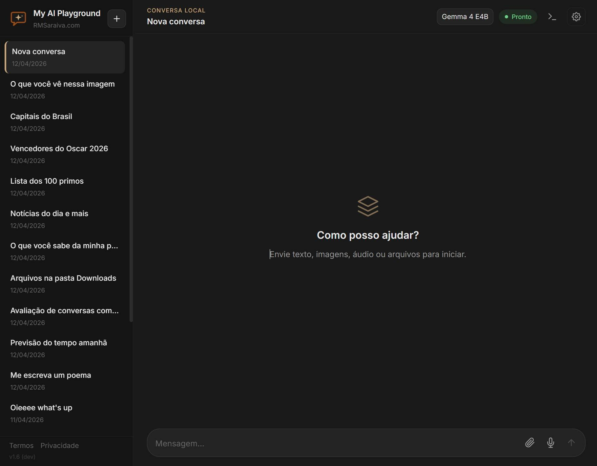
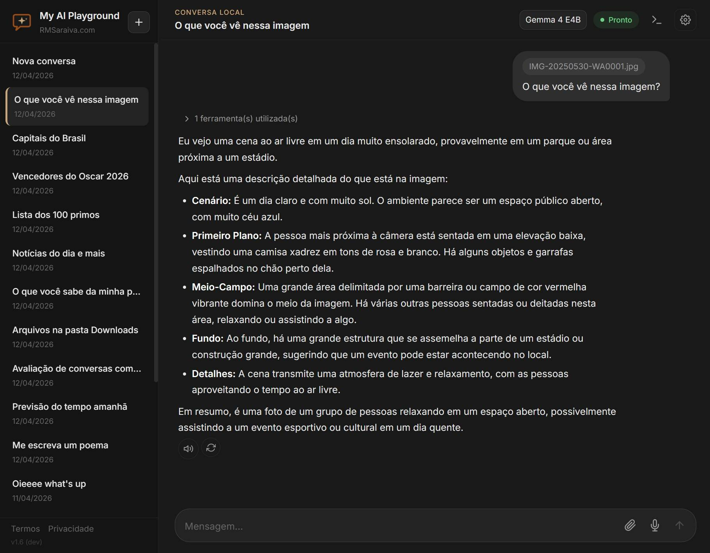
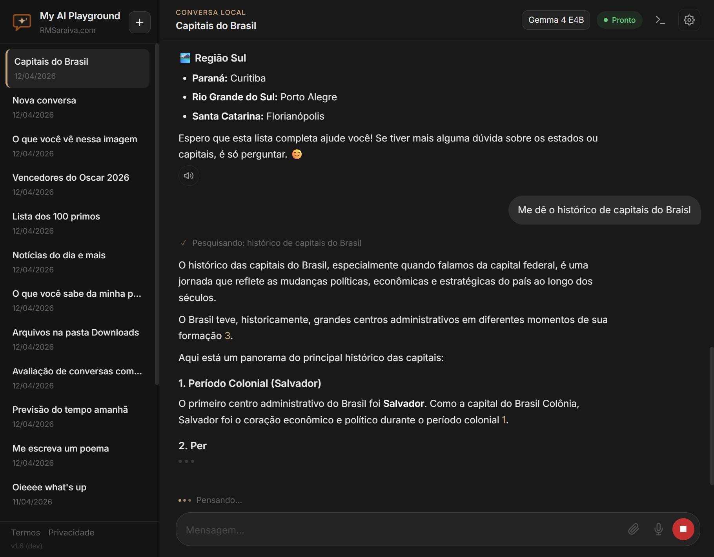
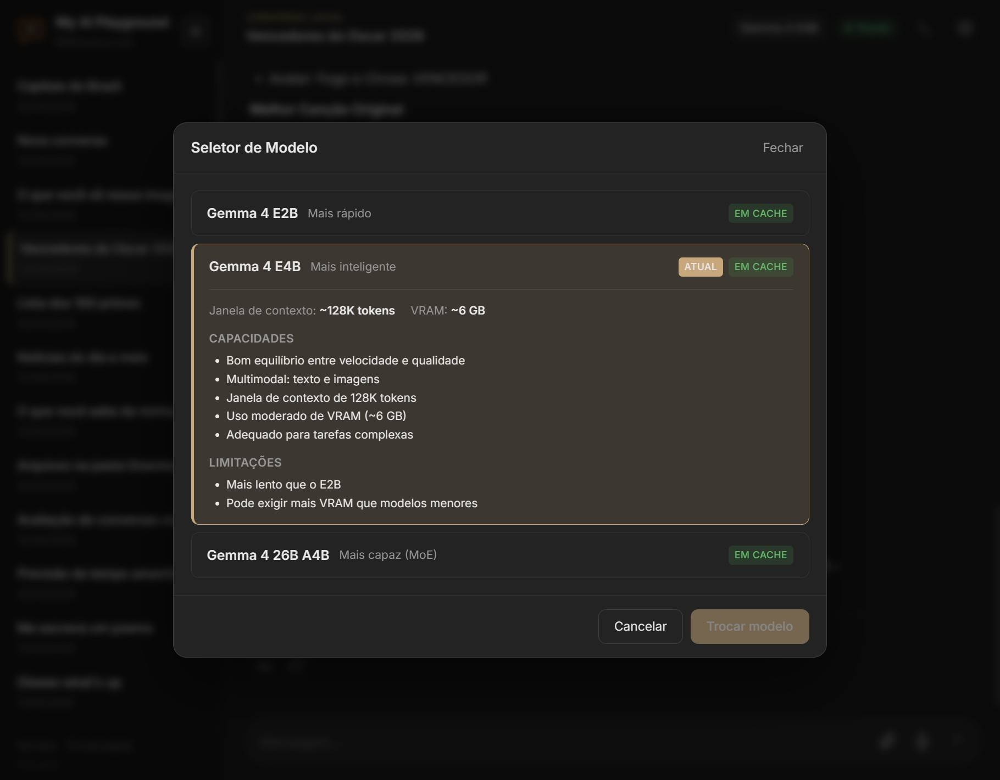
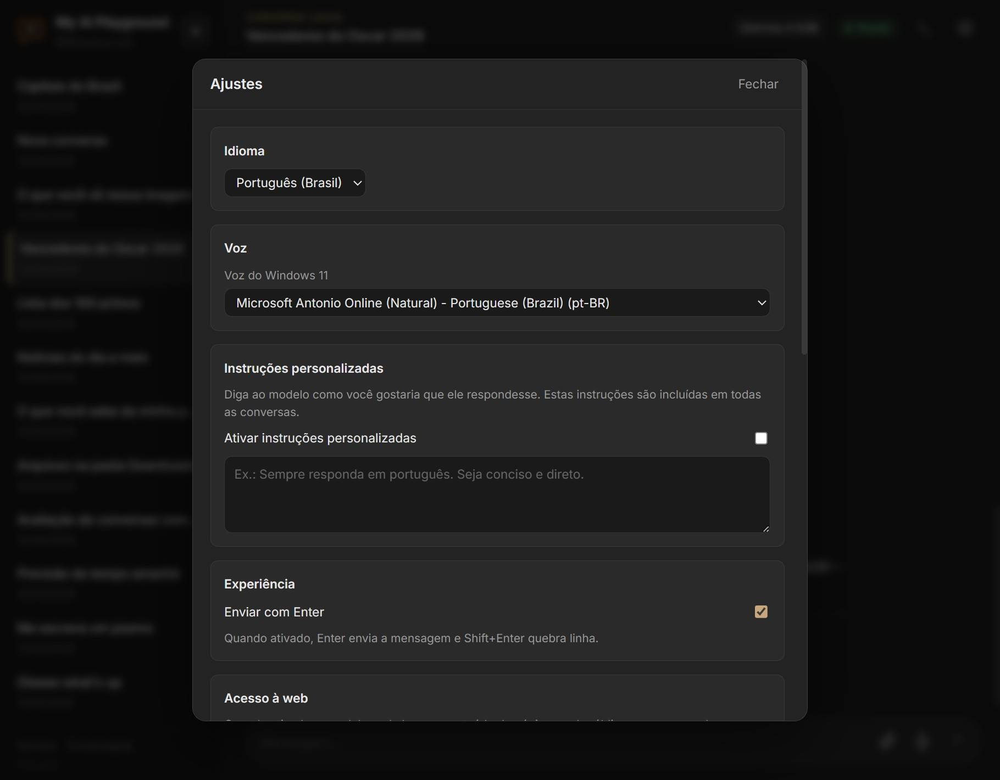
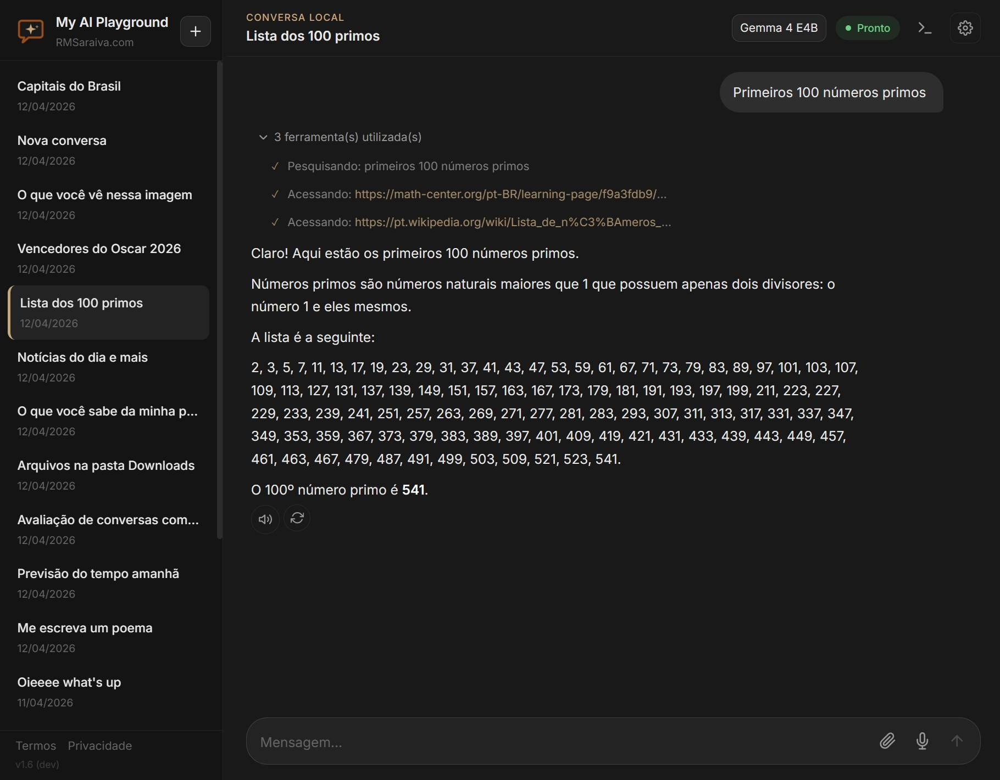

<p align="center">
  
</p>

<h1 align="center">My AI Playground</h1>

<p align="center">
  Aplicação desktop-local para conversas com modelos <a href="https://ai.google.dev/gemma">Gemma</a> rodando inteiramente na sua máquina.<br/>
  Interface web moderna, entrada multimodal (texto, imagens, áudio, arquivos) e histórico salvo apenas localmente.
</p>

<p align="center">

   

</p>

---

## Funcionalidades

| Categoria | Descrição |
|---|---|
| **Chat multimodal** | Texto, imagens, áudio e arquivos em uma única conversa — envio simultâneo de múltiplos arquivos; imagens em PNG, JPEG, WebP, GIF, SVG, HEIC/HEIF, AVIF, BMP, ICO e TIFF |
| **Modelos Gemma** | Gemma 4 E2B, E4B e 26B-A4B via GGUF — troque de modelo a qualquer momento pela interface |
| **Arquivos de texto** | 60+ extensões de código e dados (`.py`, `.ts`, `.json`, `.csv`, `.xml`, `.yaml`, `.sql`, `.rs`, `.go`…) lidos como texto |
| **Documentos** | PDF, Word (`.docx`), Excel (`.xlsx`) e PowerPoint (`.pptx`) — extração de texto automática |
| **Pesquisa na web** | Busca via DuckDuckGo e leitura de páginas — o modelo cita fontes com referências numeradas `[1]`, `[2]`… |
| **Acesso a arquivos locais** | O modelo pode listar e ler arquivos de pastas permitidas pelo usuário (somente leitura) |
| **Visão de imagens locais** | Em modelos com visão (Gemma 4 E2B/E4B), o modelo pode ver e descrever imagens de pastas permitidas |
| **Tool calling** | O modelo pode chamar ferramentas (web, filesystem, visão) automaticamente; chamadas ficam salvas no histórico e são exibidas de forma auditável |
| **Instruções personalizadas** | System prompt customizável pelo usuário nos Ajustes — aplicado a todas as conversas |
| **Inferência local** | llama.cpp server com CUDA, flash attention, contexto por modelo (128K–256K tokens) |
| **Streaming** | Respostas exibidas token a token em tempo real |
| **Auto-continuação** | Respostas longas continuam automaticamente quando o limite de tokens é atingido (até 5 rodadas) |
| **Gravação de voz** | Gravar, pausar, retomar e parar antes de enviar; áudio convertido para WAV 16 kHz; timer com contagem regressiva |
| **Transcrição** | Whisper (faster-whisper) converte áudio em texto localmente |
| **Leitura de respostas** | Text-to-Speech via Web Speech API com preferência para vozes Microsoft |
| **Markdown rico** | Renderização com GFM, blocos de código com syntax highlight, matemática KaTeX |
| **Edição de mensagens** | Editar mensagens enviadas e regenerar respostas |
| **Pesquisa de mensagens** | Busque conversas por título ou conteúdo — destaque automático dos termos encontrados |
| **Localização** | Compartilhamento opcional de geolocalização para respostas mais contextualizadas (desativado por padrão) |
| **Avaliação de risco** | Instruções personalizadas são avaliadas automaticamente pelo LLM; alerta exibido apenas quando o risco é significativo |
| **i18n** | Português (BR), English (US), Español e Français — detecta automaticamente o idioma do navegador |
| **Tema escuro** | UI minimalista e responsiva com design dark-mode |
| **Janela deslizante** | Gestão automática de contexto: truncamento de conteúdo longo, descarte de mensagens antigas e retry em estouro |
| **Privacidade total** | Conversas e arquivos ficam em `data/` no seu disco. Nada é enviado para a nuvem. |

---

## Interface

<p align="center">
  <br/>
  <em>Interface principal com tema escuro — conversa com o modelo Gemma 4 E4B</em>
</p>

<p align="center">
  <br/>
  <em>Envio de imagem com análise visual pelo modelo</em>
</p>

<p align="center">
  <br/>
  <em>Resposta em tempo real — tokens aparecem conforme são gerados</em>
</p>

<p align="center">
  <br/>
  <em>Seletor de modelos com descrições de capacidade e limitações</em>
</p>

<p align="center">
  <br/>
  <em>Painel de ajustes — idioma, voz, instruções personalizadas, acesso web, arquivos locais</em>
</p>

<p align="center">
  <br/>
  <em>Pesquisa na web com citação de fontes numeradas</em>
</p>

---

## Requisitos de Sistema

O My AI Playground roda modelos de IA localmente no seu hardware. Os requisitos variam conforme o modelo escolhido.

### Mínimos (modelo Gemma 4 E2B — 2B parâmetros)

| Componente | Requisito |
|---|---|
| **SO** | Windows 10/11 (64 bits) |
| **RAM** | 8 GB |
| **VRAM (GPU)** | 4 GB (NVIDIA com CUDA) ou modo CPU |
| **Disco** | ~3 GB para o modelo + ~1 GB para dependências |
| **CPU** | Qualquer x86-64 com suporte AVX2 |

### Recomendados (modelo Gemma 4 E4B — 4B parâmetros)

| Componente | Requisito |
|---|---|
| **RAM** | 16 GB |
| **VRAM (GPU)** | 6 GB (NVIDIA com CUDA) |
| **Disco** | ~5 GB para o modelo |

### Para o modelo maior (Gemma 4 26B-A4B — 26B parâmetros, MoE)

| Componente | Requisito |
|---|---|
| **RAM** | 32 GB |
| **VRAM (GPU)** | 16 GB+ (NVIDIA com CUDA) |
| **Disco** | ~15 GB para o modelo |

> **Nota:** sem VRAM suficiente, o llama.cpp fará offloading para a RAM do sistema (modo CPU/parcial), resultando em inferência significativamente mais lenta. Se você receber erros de **Out of Memory (OOM)**, experimente um modelo menor ou reduza `N_CTX` no arquivo `backend/.env`.

---

## Início rápido (Windows)

### Opção A — Instalador gráfico

Na [página de releases](https://github.com/xBrasil/myAIplayground/releases) está disponível um instalador `.exe` para Windows (criado com [Inno Setup](https://jrsoftware.org/isinfo.php)). O assistente de instalação copia os arquivos, cria atalhos no Menu Iniciar e na Área de Trabalho, e opcionalmente executa a configuração de dependências ao final.

> **Nota:** Python 3.11+ e Node.js 20+ são instalados automaticamente via `winget` se ainda não estiverem presentes — desde que o instalador seja executado como Administrador. Sem privilégios de admin, instale-os manualmente antes.

### Opção B — Via scripts

#### Pré-requisitos

- **Windows 10/11** (64 bits)
- **Python 3.11+**
- **Node.js 20+**
- **GPU NVIDIA** com drivers atualizados (recomendado; funciona sem GPU em modo CPU)

#### Instalação

```powershell
install.cmd
```

O instalador:
- Detecta e instala Python e Node.js automaticamente via `winget` (se executado como Administrador)
- Cria o ambiente virtual `.venv` e instala dependências do backend
- Instala dependências npm do frontend
- Baixa o binário mais recente do `llama-server` (CUDA ou CPU, conforme sua GPU)
- Cria `backend/.env` a partir de `.env.example`

#### Execução

```powershell
run.cmd
```

O launcher:
- Inicia backend (FastAPI na porta 8000) e frontend (Vite na porta 5173)
- Aguarda ambos ficarem prontos e abre a interface no navegador
- Reutiliza serviços já em execução — seguro rodar mais de uma vez
- Logs salvos em `data/backend.log` e `data/frontend.log`

> **Dica:** o primeiro uso de cada modelo envolve download do GGUF do Hugging Face. Modelos ficam em cache em `data/model-cache/`.

---

## Início rápido (Linux / macOS)

### Pré-requisitos

- **Python 3.11+** com `venv` (`python3-venv` no Ubuntu/Debian)
- **Node.js 20+**
- **GPU NVIDIA** com drivers atualizados (recomendado; funciona sem GPU em modo CPU)
- `curl` e `unzip` instalados

### Instalação

```bash
chmod +x install.sh
./install.sh
```

O instalador faz as mesmas etapas da versão Windows: cria `.venv`, instala dependências, baixa `llama-server` e prepara `.env`.

### Execução

```bash
./run.sh
```

Inicia backend e frontend, aguarda ambos ficarem prontos e abre o navegador. Use `Ctrl+C` para encerrar.

> **Nota:** o script detecta automaticamente macOS (arm64/x64) e Linux para baixar o binário correto do llama-server.

---

## Modelos disponíveis

| Modelo | Arquivo GGUF | Quantização | Contexto | Uso típico |
|---|---|---|---|---|
| **Gemma 4 E2B** | `gemma-4-E2B-it-Q8_0.gguf` | Q8_0 | 128K | Rápido, ideal para testes |
| **Gemma 4 E4B** | `gemma-4-E4B-it-Q4_K_M.gguf` | Q4_K_M | 128K | Equilíbrio entre qualidade e velocidade |
| **Gemma 4 26B-A4B** | `gemma-4-26B-A4B-it-UD-IQ4_XS.gguf` | IQ4_XS | 256K | Maior qualidade, requer mais VRAM |

O modelo E4B é o padrão. Todos são executados pelo llama.cpp via GGUF, sem PyTorch em runtime.

---

## Stack técnica

### Frontend
- **React 19** + **TypeScript** + **Vite**
- `react-markdown` + `remark-gfm` + `remark-math` + `rehype-katex`
- Web Speech API (TTS)
- MediaRecorder API (gravação de áudio)

### Backend
- **FastAPI** + **Uvicorn**
- **SQLAlchemy** (SQLite)
- **faster-whisper** (transcrição de áudio)
- **huggingface_hub** (download de modelos)
- **httpx** (comunicação com llama-server)
- **duckduckgo-search** (pesquisa web via DuckDuckGo)
- **beautifulsoup4** (extração de conteúdo de páginas web)
- **PyMuPDF** / **python-docx** / **openpyxl** / **python-pptx** (extração de texto de documentos)
- **pillow-heif** (suporte a HEIC e AVIF no Pillow)
- **svglib** + **reportlab** (renderização de SVG para análise visual)

### Inferência
- **llama.cpp server** (binário pré-compilado, CUDA ou CPU)
- Gerenciado automaticamente pelo backend — download, inicialização e fallback

---

## Estrutura do projeto

```
myAIplayground/
├── frontend/          # React + Vite (interface web)
│   └── src/
│       ├── components/   # Sidebar, ChatLayout, Composer, MessageList...
│       ├── lib/          # API client, preferências, speech, i18n
│       └── locales/      # pt-BR.json, en-US.json, es-ES.json, fr-FR.json
├── backend/           # FastAPI (API + serviços)
│   └── app/
│       ├── api/routes/   # chat, conversations, health, legal, models, settings
│       ├── core/         # config (pydantic-settings)
│       └── services/     # chat, model, storage, input_adapter, document, web, filesystem, whisper
├── data/              # Dados locais (ignorados pelo git)
│   ├── app.db            # SQLite com conversas e mensagens
│   ├── uploads/          # Arquivos enviados nas conversas
│   ├── model-cache/      # GGUF e mmproj baixados do HF
│   └── llama-server/     # Binário do llama-server
├── docs/              # Documentação adicional
├── scripts/           # Scripts utilitários (install, run, release, i18n, test)
├── install.cmd        # Instalação automatizada (Windows)
├── run.cmd            # Launcher (Windows)
├── install.sh         # Instalação automatizada (Linux / macOS)
├── run.sh             # Launcher (Linux / macOS)
└── README.md
```

---

## Privacidade

- As conversas são salvas apenas em `data/app.db` (local).
- Arquivos enviados ficam em `data/uploads/` (local).
- Os ajustes do aplicativo (idioma, voz, instruções personalizadas, pastas permitidas etc.) ficam em `data/settings.json` (local).
- O download inicial dos modelos vem do Hugging Face. Após isso, tudo roda offline.
- **Pesquisa web**: quando ativada nos Ajustes, o modelo pode fazer buscas no DuckDuckGo e acessar páginas web. Essas requisições saem da sua máquina. Desative nos Ajustes para modo totalmente offline.
- **Acesso a arquivos locais**: quando ativado nos Ajustes, o modelo pode ler arquivos **somente** das pastas que você permitiu explicitamente. Acesso é READ-ONLY e protegido contra travessia de diretório.
- A funcionalidade de Text-to-Speech usa a API `speechSynthesis` do navegador. O comportamento (local vs. online) depende da voz selecionada e da configuração do sistema.

---

## Modelos de IA (Gemma)

> **Aviso:** Este projeto **não é afiliado, patrocinado nem endossado pelo Google ou pela Alphabet Inc.** "Gemma" é uma marca do Google. Os modelos Gemma são utilizados sob os termos de licenciamento disponibilizados pelo Google.

Os modelos de IA utilizados por esta aplicação (família **Google Gemma**) **não são distribuídos** com este repositório. Eles são baixados diretamente do [Hugging Face](https://huggingface.co/) mediante solicitação do usuário e estão sujeitos aos [Termos de Uso do Gemma](https://ai.google.dev/gemma/terms) do Google.

Ao baixar e usar esses modelos, você concorda em cumprir os termos do Google, que incluem restrições à geração de conteúdo prejudicial, ilegal ou enganoso.

---

## Licença

Este projeto é licenciado sob a [Apache License 2.0](LICENSE).

```
Copyright 2026 Rodolfo Motta Saraiva
```

Criado por [Rodolfo Motta Saraiva](https://rmsaraiva.com/) como projeto pessoal de código aberto.

### Componentes de terceiros

| Componente | Licença |
|---|---|
| [llama.cpp](https://github.com/ggml-org/llama.cpp) | MIT |
| [FastAPI](https://github.com/tiangolo/fastapi) | MIT |
| [React](https://github.com/facebook/react) | MIT |
| [Hugging Face Hub](https://github.com/huggingface/huggingface_hub) | Apache 2.0 |
| [faster-whisper](https://github.com/SYSTRAN/faster-whisper) | MIT |
| [duckduckgo-search](https://github.com/deedy5/duckduckgo_search) | MIT |
| [beautifulsoup4](https://www.crummy.com/software/BeautifulSoup/) | MIT |
| [pillow-heif](https://github.com/bigcat88/pillow_heif) | BSD-3-Clause |
| [svglib](https://github.com/deeplook/svglib) | LGPL-3.0 |
| [reportlab](https://www.reportlab.com/dev/opensource/) | BSD-3-Clause |
| [Google Gemma 4](https://ai.google.dev/gemma) (modelos de IA — não distribuídos) | [Gemma Terms of Use](https://ai.google.dev/gemma/terms) |

---

## English Summary

**My AI Playground** is an open-source, desktop-local application for chatting with [Google Gemma](https://ai.google.dev/gemma) AI models running entirely on your machine. It features a modern web UI, multimodal input (text, images, audio, files), and conversation history stored only locally.

> **Disclaimer:** This project is **not affiliated with, sponsored by, or endorsed by Google or Alphabet Inc.** "Gemma" is a trademark of Google. The Gemma models are used under the licensing terms provided by Google.

### Features

- **Multimodal chat** — text, images, audio and files in a single conversation; multiple attachments per message. Image formats: PNG, JPEG, WebP, GIF, SVG, HEIC/HEIF, AVIF, BMP, ICO, TIFF.
- **Gemma models** — Gemma 4 E2B, E4B and 26B-A4B via GGUF; switch models at any time from the UI.
- **Text files** — 60+ code and data extensions (`.py`, `.ts`, `.json`, `.csv`, `.xml`, `.yaml`, `.sql`, `.rs`, `.go`…) read as plain text.
- **Documents** — PDF, Word (`.docx`), Excel (`.xlsx`) and PowerPoint (`.pptx`) with automatic text extraction.
- **Web search** — DuckDuckGo search and page reading; the model cites sources with numbered references (`[1]`, `[2]`…).
- **Local filesystem access** — the model can list and read files from folders you explicitly allow (read-only, directory-traversal protected).
- **Local image vision** — on vision-capable models (Gemma 4 E2B/E4B), the model can see and describe images from allowed folders.
- **Tool calling** — the model calls tools (web, filesystem, vision) automatically; calls are persisted and rendered auditably in the history.
- **Custom instructions** — user-defined system prompt applied to all conversations.
- **Local inference** — llama.cpp server with CUDA, flash attention, per-model context (128K–256K tokens).
- **Streaming** — responses rendered token by token in real time.
- **Auto-continuation** — long responses continue automatically when the token limit is reached (up to 5 rounds).
- **Voice recording** — record, pause, resume and stop before sending; audio converted to 16 kHz WAV with a countdown timer.
- **Transcription** — Whisper (faster-whisper) converts audio to text locally.
- **Text-to-Speech** — Web Speech API with preference for Microsoft voices.
- **Rich Markdown** — GFM rendering, syntax-highlighted code blocks, KaTeX math.
- **Message editing** — edit sent messages and regenerate responses.
- **Message search** — search conversations by title or content with term highlighting.
- **Location** — optional geolocation sharing for more context-aware answers (off by default).
- **Risk evaluation** — custom instructions are evaluated automatically by the LLM; alerts shown only when risk is significant.
- **i18n** — Portuguese (BR), English (US), Spanish and French; auto-detects browser language.
- **Dark theme** — minimalist responsive UI.
- **Sliding window** — automatic context management: long-content truncation, old-message eviction and retry on overflow.

### System Requirements

| Model | RAM | VRAM (NVIDIA CUDA) | Disk |
|---|---|---|---|
| Gemma 4 E2B (2B) | 8 GB | 4 GB (or CPU-only) | ~3 GB |
| Gemma 4 E4B (4B) | 16 GB | 6 GB | ~5 GB |
| Gemma 4 26B-A4B (26B MoE) | 32 GB | 16 GB+ | ~15 GB |

> Without sufficient VRAM, llama.cpp will offload layers to system RAM (CPU mode), resulting in significantly slower inference. If you encounter **OOM errors**, try a smaller model or reduce `N_CTX` in `backend/.env`.

### Installation

#### Prerequisites

- **Python 3.11+** (on Linux/macOS, the `venv` module — `python3-venv` on Ubuntu/Debian)
- **Node.js 20+**
- **NVIDIA GPU** with up-to-date drivers (recommended; runs on CPU otherwise)
- **Windows 10/11 (64-bit)**, modern Linux, or macOS (arm64/x64)
- On Linux/macOS: `curl` and `unzip`

#### Windows — graphical installer

A signed `.exe` installer (built with [Inno Setup](https://jrsoftware.org/isinfo.php)) is available on the [releases page](https://github.com/xBrasil/myAIplayground/releases). The wizard copies files, creates Start Menu and Desktop shortcuts, and optionally runs the dependency setup at the end.

> **Note:** Python 3.11+ and Node.js 20+ are installed automatically via `winget` if missing — provided the installer is run as Administrator. Without admin privileges, install them manually first.

#### Windows — via scripts

```powershell
install.cmd
```

The installer:
- Detects and installs Python and Node.js automatically via `winget` (when run as Administrator)
- Creates the `.venv` virtual environment and installs backend dependencies
- Installs frontend npm dependencies
- Downloads the latest `llama-server` binary (CUDA or CPU, according to your GPU)
- Creates `backend/.env` from `.env.example`

Launch with:

```powershell
run.cmd
```

#### Linux / macOS

```bash
chmod +x install.sh run.sh
./install.sh
./run.sh
```

The installer performs the same steps as the Windows version: creates `.venv`, installs dependencies, downloads `llama-server` and prepares `.env`. The script auto-detects macOS (arm64/x64) and Linux to pick the correct `llama-server` binary. Press `Ctrl+C` to stop.

#### What the launcher does

- Starts backend (FastAPI on port 8000) and frontend (Vite on port 5173)
- Waits for both to be ready and opens the UI in your browser
- Reuses already-running services — safe to run more than once
- Logs saved to `data/backend.log` and `data/frontend.log`

> **Tip:** the first use of each model triggers a GGUF download from Hugging Face. Models are cached in `data/model-cache/`.

### Privacy

- Conversations are stored in a local SQLite database (`data/app.db`).
- Uploaded files stay in `data/uploads/`.
- App settings (language, voice, custom instructions, allowed folders, etc.) are stored in `data/settings.json`.
- Initial model downloads come from Hugging Face. After that, everything runs offline.
- **Web search**: when enabled in Settings, the model can query DuckDuckGo and fetch pages. Those requests leave your machine — disable it for fully offline mode.
- **Local filesystem access**: when enabled, the model can read files **only** from folders you explicitly allowed. Access is read-only and protected against directory traversal.
- Text-to-Speech uses the browser's `speechSynthesis` API; local vs. online behavior depends on the selected voice and system settings.
- No analytics or telemetry.

### Key points

- **100% local inference** — all AI processing runs on your hardware via [llama.cpp](https://github.com/ggml-org/llama.cpp) (GGUF format). No data is sent to cloud services during normal chat use.
- **Gemma models are not included** — they are downloaded from [Hugging Face](https://huggingface.co/) at the user's request and are subject to [Google's Gemma Terms of Use](https://ai.google.dev/gemma/terms).
- **Stack**: React 19 + TypeScript + Vite (frontend), FastAPI + SQLAlchemy (backend), llama.cpp server (inference), faster-whisper (speech-to-text).
- **License**: [Apache License 2.0](LICENSE) — Copyright 2026 Rodolfo Motta Saraiva.

