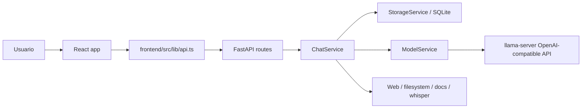

# Project Map - My AI Playground

Atualizado em: 2026-06-13

Este mapa existe para acelerar manutencao futura. Ele resume a arquitetura, os
fluxos principais, os pontos de entrada e as funcoes/classes que mais importam
para mudar o projeto com seguranca.

Nota de privacidade: `data/user/` contem dados reais do usuario, incluindo
`app.db`, uploads, settings e aceite legal. Use a estrutura dessa pasta como
referencia, mas nao abra conteudo de banco/uploads/settings salvo quando a tarefa
pedir explicitamente.

## Visao Geral

O projeto e um app desktop-local para conversar com modelos Gemma 4 via
`llama.cpp`/`llama-server`, com frontend React/Vite, backend FastAPI e estado
local em SQLite/JSON.

Fluxo principal:

Camadas:

- `frontend/`: React 19 + TypeScript + Vite. Controla UX, streaming, anexos,
  gravacao de voz, settings, selecao de modelo e renderizacao de mensagens.
- `backend/`: FastAPI + SQLAlchemy. Expoe API local, persiste conversas,
  normaliza uploads, constroi prompts, gerencia ferramentas e chama o modelo.
- `scripts/`: instalacao, execucao, tray launcher, release e checks.
- `data/`: estado runtime ignorado pelo git. Divide `data/user` (preservavel) e
  `data/system` (cache, logs, llama-server).
- `docs/`: screenshots e este mapa.

## Stack E Contratos

- Backend: FastAPI, Uvicorn, SQLAlchemy, Pydantic Settings, SQLite, httpx,
  huggingface_hub, faster-whisper, Pillow, pillow-heif, svglib/reportlab,
  PyMuPDF, python-docx, openpyxl, python-pptx.
- Frontend: React 19, TypeScript, Vite, react-markdown, remark-gfm,
  remark-math, rehype-katex, Web Speech API, MediaRecorder API.
- Modelo: `llama-server` em `data/system/llama-server`, exposto em
  `http://127.0.0.1:8081/v1/chat/completions` por padrao.
- API do app: `http://127.0.0.1:<API_PORT>/api`, porta padrao 8000.
- UI: Vite em `http://127.0.0.1:<frontendPort>`, porta padrao 5173.
- Streaming app -> frontend: NDJSON, uma linha JSON por evento.

Eventos de stream:

- `conversation`: conversa criada/atualizada no inicio do stream.
- `delta`: trecho de resposta do modelo.
- `tool_start`: modelo iniciou uma tool call.
- `tool_done`: tool call terminou.
- `done`: conversa final, mensagem assistant persistida, tool calls e follow-ups.

## Pastas E Arquivos

### Raiz

- `README.md`: documentacao de produto, instalacao, privacidade, modelos e stack.
- `VERSION`: versao usada em build/release.
- `install.cmd`, `run.cmd`, `tray.cmd`: wrappers Windows para scripts.
- `install.sh`, `run.sh`, `tray.sh`: wrappers Unix.
- `.gitignore`: ignora `.venv`, `node_modules`, `dist`, `.vite`,
  `frontend/src/app-info.ts`, `.env`, `data/`, logs e releases.
- `.gitattributes`: forca LF em scripts `.sh`.

### Runtime Ignorado

- `data/user/app.db`: SQLite com conversas/mensagens.
- `data/user/uploads/`: anexos enviados.
- `data/user/settings.json`: settings persistidos pelo app.
- `data/user/legal-acceptance.json`: aceite legal.
- `data/system/.env`: configuracao runtime preferida.
- `data/system/model-cache/`: cache Hugging Face.
- `data/system/llama-server/`: binario do `llama-server`.
- `data/system/logs/`: logs backend/frontend/install.
- `data/system/.ports`: portas dinamicas escritas pelos launchers.

## Backend

### `backend/app/main.py`

Responsavel por criar a aplicacao FastAPI.

- `settings = get_settings()`: carrega config uma vez no import.
- `lifespan(app)`: cria tabelas/migracoes leves, carrega modelo se habilitado,
  e chama shutdown do `ModelService` no encerramento.
- `app = FastAPI(...)`: registra CORS, monta `/uploads` e inclui routers.

### `backend/app/core/config.py`

Carrega `.env` de `data/system/.env`, com fallback para `data/.env`.

- `Settings`: centraliza portas, paths, repos/arquivos GGUF, mmproj, contexto,
  flash attention, server host/port, tokens de imagem, modelo Whisper e default
  `12b`.
- `resolved_database_path`: resolve `DATABASE_URL` SQLite para path absoluto.
- `resolved_upload_dir`: resolve pasta local de uploads.
- `resolved_model_cache_dir`: resolve cache de modelos.
- `get_settings()`: cache LRU para uma unica instancia de settings.

### `backend/app/db.py`

Inicializa SQLite e sessao SQLAlchemy.

- `Base`: classe declarativa base.
- `get_db()`: dependency FastAPI que abre/fecha session.
- `create_db_and_tables()`: cria tabelas e aplica migracoes leves com
  `ALTER TABLE` para colunas novas (`model_key`, `tool_calls_json`,
  `custom_instructions_snapshot`, `custom_instructions_risk_score`,
  `follow_ups_json`).

### `backend/app/models.py`

Modelos ORM.

- `Conversation`: conversa com `id`, `title`, timestamps, `follow_ups_json` e
  relacionamento `messages`.
- `Conversation.follow_ups`: desserializa JSON de follow-ups com fallback seguro.
- `Message`: mensagem com role, conteudo, tipo de input, modelo, anexo,
  tool calls e snapshot/risco de custom instructions.

### `backend/app/schemas.py`

Contratos Pydantic entre backend e frontend.

- `_utc_to_local_iso`: converte datetimes UTC naive do SQLite para ISO local.
- `MessageCreate`, `MessageRead`: entrada/leitura de mensagem.
- `ConversationCreate`, `ConversationRename`, `ConversationRead`: conversa.
- `ModelOption`, `ModelSetupStatus`, `ModelSelectionRequest`,
  `ModelSelectionResponse`: selecao e estado de modelo.
- `HealthResponse`: payload de `/api/health`.
- `ChatRequest`, `ChatResponse`: payloads de chat.
- `DeleteConversationResponse`, `DeleteAllConversationsRequest`: delecao.
- `RiskEvaluationRequest`, `RiskEvaluationResponse`: avaliacao de risco.
- `ServerConfigResponse`: URL/modelo/status do `llama-server`.
- `VoicePreferences`: preferencia de voz legada/compatibilidade.

## Backend: Rotas

### `backend/app/api/routes/chat.py`

Router: `/api/chat`. E o ponto HTTP mais complexo.

Helpers:

- `_estimate_content_tokens(kind, file_path, raw_bytes)`: estima tokens pelo
  conteudo real enviado ao modelo; documentos sao extraidos antes da contagem.
- `_check_upload_budget(total_tokens)`: rejeita upload acima de 90% do contexto.
- `_local_iso(dt)`: serializa datetime local.
- `_event_line(payload)`: serializa evento NDJSON.
- `_iter_stream(stream, chunks, tool_calls_out)`: converte stream do modelo em
  eventos `delta`/tool e acumula texto/tool calls.
- `_serialize_conversation(current_conversation)`: converte ORM para dict do
  frontend, incluindo mensagens e tool calls.
- `_serialize_message(message)`: serializa uma mensagem.
- `_get_settings()`: wrapper para settings usado por file actions.

Endpoints:

- `POST /evaluate-risk` -> `evaluate_risk`: avalia risco de custom instructions.
- `GET /search` -> `search_conversations`: busca por titulo/conteudo.
- `POST ""` -> `send_text_message`: chat sem streaming.
- `POST /stream` -> `stream_text_message`: chat texto com NDJSON.
- `POST /upload` -> `send_upload_message`: upload unico sem streaming.
- `POST /upload/stream` -> `stream_upload_message`: upload unico com NDJSON.
- `POST /upload/multi/stream` -> `stream_multi_upload_message`: multiplos
  arquivos com NDJSON.
- `POST /{conversation_id}/save-partial` -> `save_partial`: salva resposta
  parcial quando o usuario interrompe um stream.
- `POST /file/open` -> `open_file`: abre arquivo de upload no sistema, somente
  se estiver dentro de `UPLOAD_DIR`.
- `POST /file/reveal` -> `reveal_file`: revela arquivo de upload no Explorer,
  Finder ou gerenciador de arquivos.
- `POST /{conversation_id}/edit-last/stream` -> `edit_last_message_stream`:
  edita ultima mensagem do usuario, remove respostas posteriores e regenera.
- `POST /{conversation_id}/regenerate/stream` -> `regenerate_last_stream`:
  remove ultima resposta assistant e gera outra.

Request models locais:

- `FileActionRequest`: path de anexo.
- `SavePartialRequest`: texto parcial.
- `EditLastRequest`: nova mensagem e flags de ferramentas/settings.
- `RegenerateRequest`: flags de ferramentas/settings.

### `backend/app/api/routes/conversations.py`

Router: `/api/conversations`.

- `list_conversations`: lista conversas ordenadas por update desc.
- `create_conversation`: cria conversa manual.
- `get_conversation`: carrega uma conversa ou 404.
- `rename_conversation`: renomeia ou 404.
- `delete_conversation`: remove conversa, mensagens e anexos seguros.
- `delete_all_conversations`: exige `DELETE ALL` e remove tudo.

### `backend/app/api/routes/health.py`

- `healthcheck`: agrega status do app/modelo/GPU/contexto/modelos disponiveis.
- `shutdown`: valida Origin/Referer local, para `llama-server` e encerra o
  backend com delay para a resposta HTTP sair.

### `backend/app/api/routes/models.py`

Router: `/api/models`.

- `get_active_model`: retorna estado de selecao atual.
- `select_model`: dispara troca assincrona de modelo.
- `get_server_config`: retorna base URL do `llama-server` e model id ativo.

### `backend/app/api/routes/settings.py`

Persistencia simples de settings em `data/user/settings.json`.

- `_settings_path`: path do JSON.
- `_read_settings`: le JSON com fallback para `{}`.
- `_write_settings`: escreve atomico via arquivo temporario.
- `get_all_settings`: GET com lock.
- `patch_settings`: PATCH merge/remocao (`null` remove chave) com lock.

### `backend/app/api/routes/legal.py`

Persistencia de aceite legal em `data/user/legal-acceptance.json`.

- `_acceptance_path`: path do JSON.
- `AcceptRequest`: locale e hash dos textos legais.
- `get_acceptance`: retorna aceite salvo ou `accepted: false`.
- `accept_terms`: salva locale, hash e timestamp UTC.

## Backend: Servicos

### `backend/app/services/chat_service.py`

Centro de orquestracao de chat. Ele transforma estado persistido em mensagens
OpenAI-compatible, injeta anexos, adiciona system prompt, habilita tools e chama
`ModelService`.

Constantes:

- `LANG_NAMES`: nomes de idioma para system prompt.
- `_TITLE_LABELS`: titulos fallback por locale.
- `_MAX_READ_CHARS`: limite de leitura por arquivo.
- `_IMAGE_EXTS`: extensoes tratadas como imagem.
- `_GENERATION_RESERVE`: tokens reservados para resposta.

Principais metodos:

- `_tl(locale, key)`: pega label localizada de fallback.
- `model_loaded`: proxy para `model_service.is_loaded`.
- `_ensure_conversation(db, conversation_id, seed_text, locale)`: reusa ou cria
  conversa com titulo inicial.
- `_default_multimodal_instruction(input_type)`: instrucao fallback para audio,
  imagem ou conteudo.
- `_build_audio_instruction(user_text, attachment_name)`: separa upload de audio
  de "voz ao vivo" e inclui pedido do usuario.
- `_transcribe_audio(attachment_path)`: usa Whisper com log e fallback vazio.
- `_read_text_file(file_path)`: le texto com hard cap.
- `_read_document_file(file_path)`: extrai texto via `document_service`.
- `_read_any_file(file_path)`: escolhe texto/documento pela extensao.
- `_build_multi_file_prompt(names_json, paths_json, user_content)`: monta prompt
  combinado para multiplos arquivos.
- `_transcode_audio_to_wav_bytes(file_path)`: usa PyAV para WAV mono 16 kHz.
- `_load_audio_base64(file_path)`: carrega audio nativo ou transcodifica.
- `_conversation_seed_for_upload(...)`: cria seed/titulo para novas conversas
  iniciadas por upload.
- `_stored_upload_content(...)`: decide o conteudo persistido para audio,
  arquivo, documento e multi-file.
- `_sanitize_user_location(raw)`: aceita apenas `lat,lon` valido e arredonda.
- `_build_system_prompt(...)`: monta system prompt com data, idioma, localizacao,
  capacidades do modelo, web/local files e custom instructions ou safety.
- `_build_messages(...)`: converte conversa ORM em mensagens para modelo,
  injetando imagens base64, audio nativo, textos/documentos e multi-file.
- `_estimate_message_tokens(messages)`: estima tokens do payload final.
- `_trim_messages_to_budget(messages)`: trunca conteudo grande e aplica sliding
  window quando passa do contexto.
- `_get_tools(enable_web_access, enable_local_files, allowed_folders)`: retorna
  definicoes de tools web/filesystem.
- `_make_tool_executor(...)`: cria executor que despacha para web/filesystem.
- `evaluate_custom_instructions_risk(instructions)`: pede ao LLM um JSON com
  `risk_score` 0-100, com fallback seguro para 0.
- `_get_risk_score(custom_instructions)`: cacheia ultimo score de risco.
- `handle_text_message(...)`: fluxo sincrono de texto: salva user, gera reply,
  salva assistant.
- `prepare_text_stream(...)`: salva user e retorna stream para a rota.
- `finalize_streamed_reply(...)`: persiste resposta final e tool calls do stream.
- `generate_title(db, conversation_id)`: gera titulo curto legado/fallback.
- `generate_metadata(...)`: gera titulo de primeira mensagem e 1-3 follow-ups.
- `handle_file_message(...)`: fluxo sincrono de upload unico.
- `prepare_file_stream(...)`: salva upload e retorna stream.

Pontos de cuidado:

- Streaming persiste a resposta apenas no `done`; abort salva parcial via rota.
- Conteudo de file/document nao fica duplicado na mensagem; e injetado ao montar
  `_build_messages`.
- Custom instructions ficam snapshotadas apenas na resposta assistant.
- Tool calls persistidas ficam em `Message.tool_calls_json`.

### `backend/app/services/model_service.py`

Gerencia GPU, modelos, cache, `llama-server`, health, tokenizacao e chamadas de
geracao.

Dataclasses:

- `GpuInfo`: disponibilidade, vendor, backend e nome exibivel.
- `ModelProfile`: key, label, repo, arquivo GGUF, mmproj, capacidades de visao,
  necessidade de mmproj, contexto, KV cache e audio.

Estado principal:

- `_profiles`: perfis `e2b`, `e4b`, `12b`, `26b`.
- `_active_model_key`: modelo atual; default versionado e `e4b`, com fallback
  para `e2b` sem GPU.
- `_model_status`: `idle`, `loading`, `loaded`, `error`.
- `_server_process`: subprocesso `llama-server`.
- `_server_url`: URL local do `llama-server`.
- `_has_vision`, `_has_audio`: capacidades efetivas apos carregar mmproj/build.
  O Gemma 4 12B Unified usa o `mmproj-gemma-4-12b-it-qat-q4_0.gguf`
  oficial no runtime GGUF para habilitar imagem/audio; requer `llama-server`
  b9616+ por causa do projector `gemma4uv`.

Operacao/logs:

- `_log_path`, `_open_log`, `_start_log_timestamper`, `_close_log`,
  `_read_log_tail`: log timestampado de `llama-server`.
- `_shutdown`: para server e fecha cliente HTTP.
- `_server_dir`, `_find_server_binary`: localiza binario.
- `server_backend`: le `backend.txt` ou usa backend detectado.
- `_stop_server`: encerra arvore de processo, com `taskkill /T` no Windows.
- `_wait_for_server_health`: aguarda `/health`.
- `_query_props`: le `/props` para contexto real.
- `_warmup`: faz chamada curta para aquecer caches/graficos.
- `_check_audio_support`: desliga audio nativo se build antigo.
- `_server_build`: le `version.txt` para validar recursos por build.
- `context_size`: contexto real, setting ou fallback do profile.
- `estimate_tokens`: usa `/tokenize`, fallback `len(text)//4`.
- `_start_server(model_key)`: baixa GGUF/mmproj quando aplicavel, monta comando,
  tenta contexto configurado e fallback `-c 0`.
- `_download_gguf(repo_id, filename)`: baixa via HF e resolve symlink Windows.
- `_is_model_cached(profile)`, `is_model_cached(model_key)`: checa cache HF.

Propriedades/API:

- `active_model_key`, `active_model_id`, `model_status`, `is_loaded`,
  `supports_vision`, `supports_audio`, `gpu_info`, `cuda_available`.
- `_detect_gpu`: Apple Metal, NVIDIA CUDA, AMD ROCm/HIP/Vulkan, ou CPU.
- `available_models`: lista modelos com cache.
- `setup_status`: status exibido pela UI.
- `_set_failed`, `_load_selected_model`, `load`, `get_selection_state`,
  `select_model_async`: ciclo de carregamento/troca.

Geracao:

- `_prepare_messages(messages, enable_thinking)`: injeta/remove `<|think|>` no
  system prompt.
- `_clean_text`, `_clean_chunk`: remove tokens especiais.
- `_extract_server_error`, `_is_context_overflow`, `_drop_oldest_non_system`:
  tratamento de erro/contexto.
- `generate_reply_stream(...)`: streaming OpenAI-compatible com tool calls,
  multimodal `view_image`, auto-continue por `finish_reason=length`, ate 3
  rodadas de tools e retry de contexto.
- `generate_reply(...)`: versao sincrona com logica equivalente.

### `backend/app/services/storage_service.py`

Persistencia de conversas, mensagens e uploads.

- `search_conversations`: busca por titulo primeiro e depois conteudo.
- `_conversation_statement`: select com `selectinload(messages)`.
- `list_conversations`: lista ordenada por `updated_at`.
- `create_conversation`: cria conversa UUID.
- `get_conversation`: busca por id.
- `rename_conversation`: altera titulo.
- `set_follow_ups`, `clear_follow_ups`: controla follow-ups JSON.
- `append_message`: cria mensagem, atualiza conversa e commita.
- `touch_conversation`: commit leve em conversa.
- `delete_message`: remove mensagem por id.
- `update_message_content`: edita conteudo de mensagem.
- `save_upload`: grava bytes em `UPLOAD_DIR` com prefixo UUID.
- `_safe_attachment_paths`: coleta anexos que continuam dentro de uploads.
- `_delete_files`: apaga arquivos seguros.
- `delete_conversation`: remove conversa e anexos.
- `delete_all_conversations`: remove todas as conversas/anexos.

### `backend/app/services/input_adapter_service.py`

Classificacao e carregamento de uploads.

- `NormalizedUpload`: `kind`, `file_name`, `summary`, `raw_bytes`.
- `normalize_upload(upload)`: classifica como `image`, `audio`, `document`,
  `file` ou `unsupported` por MIME/extensao/UTF-8.
- `_is_decodable_utf8(data, sample_size)`: detecta texto UTF-8 sem null bytes.
- `load_image(file_path)`: abre imagem, renderiza SVG quando necessario.
- `load_image_base64(file_path)`: converte para PNG base64 data URL.
- `_load_svg(file_path)`: renderiza SVG via svglib/reportlab.

### `backend/app/services/document_service.py`

Extracao de texto de documentos.

- `extract_text(file_path, max_chars)`: escolhe extrator por extensao e captura
  erros como texto amigavel.
- `_extract_pdf`: PyMuPDF pagina a pagina.
- `_extract_docx`: paragrafo por paragrafo.
- `_extract_xlsx`: sheets e rows tab-separated.
- `_extract_pptx`: slides/shapes com text frames.

### `backend/app/services/web_service.py`

Tools web para o modelo com protecoes SSRF.

- `_HTMLTextExtractor`: parser HTML simples que pula script/style/head/svg.
- `_strip_html(html)`: extrai texto e normaliza whitespace.
- `_is_private_host(hostname)`: resolve DNS e bloqueia IP privado/loopback/link.
- `fetch_url(url)`: valida http(s), bloqueia privado, segue redirects
  revalidando destino, limita tamanho e extrai texto/titulo.
- `web_search(query)`: busca DuckDuckGo HTML Lite e retorna ate 8 resultados.
- `execute_tool_call(name, arguments)`: despacha `fetch_url`/`web_search` e
  retorna string para o modelo.
- `FETCH_URL_TOOL`, `WEB_SEARCH_TOOL`: definicoes OpenAI-compatible.

### `backend/app/services/filesystem_service.py`

Tools locais read-only para o modelo.

- `_is_path_within_allowed(target, allowed_folders)`: valida containment apos
  `resolve`.
- `_validate_path(path_str, allowed_folders)`: valida allowlist e symlink.
- `list_directory(path, allowed_folders)`: lista ate 2000 entradas.
- `read_file(path, allowed_folders)`: le texto/documento ate 2 MB e bloqueia
  extensoes binarias.
- `execute_filesystem_tool(name, arguments, allowed_folders)`: despacha
  `list_directory`, `read_file`, `view_image`.
- `LIST_DIRECTORY_TOOL`, `READ_FILE_TOOL`, `VIEW_IMAGE_TOOL`: definicoes para
  tool calling.

### `backend/app/services/whisper_service.py`

Transcricao local.

- `WhisperService.__init__`: mantem modelo e lock.
- `_ensure_loaded`: lazy load `faster-whisper`, tenta CUDA float16 e cai para CPU
  int8.
- `transcribe(audio_path)`: retorna texto combinado dos segmentos.
- `is_available`: indica se dependency existe.

## Frontend

### `frontend/src/main.tsx`

- `initSettings().finally(...)`: carrega settings persistidos do backend para
  `localStorage` antes de renderizar React.
- Renderiza `I18nProvider` e `App`.

### `frontend/src/App.tsx`

Coordenador de estado do app.

Helpers:

- `isDraft(id)`: identifica conversa local temporaria.
- `makeDraftConversation()`: cria conversa draft sem backend.
- `makeOptimisticMessage(content, inputType)`: cria mensagem temporaria.
- `computeTermsHash(terms, privacy)`: SHA-256 dos textos legais localizados.

Funcoes internas importantes:

- `refreshHealth`: consulta `/api/health`, detecta desconexao apos ja ter
  conectado.
- `upsertConversation`: insere/atualiza conversa e remove draft otimista.
- `reloadConversations`: recarrega lista, preserva draft e seleciona conversa.
- `checkLegalAcceptance`: compara aceite salvo com locale/hash atual.
- `handleAcceptLegal`: salva aceite no backend.
- `getAutoplay`: cria `AutoplayEngine` com refs estaveis.
- `handleDevCommand`: suporta `/autoplay` e `/stop` quando versao termina em
  `(dev)`.
- `handleNewConversation`: cria draft local.
- `handleSelectConversation`: marca navegacao manual durante stream.
- `handleDeleteConversation`, `handleRenameConversation`,
  `handleDeleteAllConversations`: CRUD de conversas.
- `removeOptimisticMessages`: limpa mensagens temporarias apos erro.
- `handleSendText`: fluxo principal de streaming texto com AbortController,
  optimistic UI, tool calls, parcial em abort e restore em erro.
- `handleSendTextOrCommand`: intercepta comandos dev.
- `handleSendFile`: streaming upload unico.
- `handleSendFiles`: streaming multi-upload.
- `handleStop`: aborta stream atual e autoplay.
- `handleEditLastMessage`: edita ultima mensagem user e regenera stream.
- `handleRegenerate`: regenera ultima resposta assistant.
- `handleToggleEnterToSend`, `handleChangeCustomInstructions`,
  `handleChangeCustomInstructionsEnabled`, `handleChangeWebAccess`,
  `handleChangeLocalFiles`, `handleChangeAllowedFolders`,
  `handleChangeLocationSharing`, `handleToggleAutoReadResponse`: atualizam estado
  e persistem preferencias.
- `handleSelectModel`: chama troca de modelo e atualiza health.

Pontos de cuidado:

- O app permite stream em background se o usuario navegar para outra conversa.
- `abortControllerRef` indica qual stream "possui" a UI atual.
- Resposta parcial e salva via `savePartial` apenas quando aborta com texto.
- `effectiveCustomInstructions` so e enviado se toggle estiver ativo.

### `frontend/src/types.ts`

Tipos compartilhados com backend:

- `InputType`, `ModelKey`, `ModelStatus`.
- `ToolCallInfo`, `Message`, `Conversation`, `ChatResponse`.
- `DeleteConversationResponse`.
- `ModelOption`, `ModelSetupStatus`, `ModelSelectionResponse`.
- Eventos: `StreamConversationEvent`, `StreamDeltaEvent`, `StreamDoneEvent`,
  `StreamToolStartEvent`, `StreamToolDoneEvent`, `ChatStreamEvent`.
- `HealthResponse`, `ServerConfig`.

### `frontend/src/lib/api.ts`

Cliente HTTP/NDJSON.

- `getUploadAssetUrl`: converte path de upload em URL `/uploads/<file>`.
- `getUploadMessage`: decide texto enviado com upload unico.
- `fetchHealth`, `shutdownServer`, `evaluateCustomInstructionsRisk`.
- `searchConversations`, `fetchConversations`, `createConversation`.
- `selectModel`, `deleteConversation`, `renameConversation`,
  `deleteAllConversations`.
- `sendTextMessage`: chat sincrono legado.
- `streamTextMessage`: POST `/chat/stream` e parse NDJSON.
- `sendUploadMessage`: upload sincrono legado.
- `streamUploadMessage`: upload unico com NDJSON.
- `streamMultiUploadMessage`: multi-upload com NDJSON.
- `savePartial`, `openFile`, `revealFile`.
- `streamEditLastMessage`, `streamRegenerate`.
- `fetchServerConfig`, `fetchLegalAcceptance`, `acceptLegal`.

### `frontend/src/lib/settingsApi.ts`

- `SETTING_KEYS`: chaves conhecidas de `localStorage` que devem sincronizar.
- `initSettings`: limpa chaves conhecidas e popula a partir de `/api/settings`.
- `persistSetting`: PATCH fire-and-forget para `/api/settings`.

### `frontend/src/lib/preferences.ts`

Wrappers de preferencia com `localStorage` + `persistSetting`.

- Load/save para enter-to-send, ultimo modelo, custom instructions, web access,
  local files, allowed folders, location sharing e auto-read response.

### `frontend/src/lib/i18n.tsx`

- `Locale`: `pt-BR`, `en-US`, `es-ES`, `fr-FR`.
- `detectLocale`: localStorage, navegador e fallback `en-US`.
- `interpolate`: substitui `{{param}}`.
- `I18nProvider`: estado de locale, persiste locale e ajusta `html.lang`.
- `useI18n`: hook obrigatorio dentro do provider.

### `frontend/src/lib/speech.ts`

Web Speech API.

- `ensureVoicesLoaded`: aguarda `voiceschanged` com timeout.
- `loadPreferredVoiceName`, `savePreferredVoiceName`.
- `listVoices`, `findPreferredVoice`.
- `speakText`, `createUtterance`, `stopSpeaking`.
- `onAutoTtsStart`, `onAutoTtsStop`, `autoSpeakText`.
- `stripMarkdown`: limpa markdown para leitura TTS.

### `frontend/src/lib/autoplay.ts`

Recurso dev `/autoplay`.

- `stripMarkdown`, `speakAndWait`, `getNextVoiceName`, `localeToPrefix`.
- `AutoplayCallbacks`: callbacks injetados pelo `App`.
- `AutoplayEngine.start`: valida conversa/follow-ups e inicia loop.
- `AutoplayEngine.stop`: cancela loop e TTS.
- `AutoplayEngine.loop`: escolhe follow-up, envia, le resposta anterior e espera
  nova geracao.
- `AutoplayEngine.fail`: encerra com mensagem de sistema.

### `frontend/src/lib/devMode.ts`

- `isDevMode`: true quando `APP_VERSION` termina com `(dev)`.

## Frontend: Componentes

### `ChatLayout.tsx`

Compoe a tela principal.

- `handleDragEnter`, `handleDragOver`, `handleDragLeave`, `handleDrop`: drag and
  drop de arquivos.
- `statusLabel`: label de health.
- `handleResizeStart`: resize da sidebar, persistido como `sidebarWidth`.
- Renderiza `Sidebar`, header, `ServerStatusPanel`, `MessageList`, follow-ups,
  system message e `Composer`.

### `Composer.tsx`

Entrada de texto, arquivos e audio.

- `getMaxRecordingSeconds`: 30s para audio nativo (`e2b/e4b/12b`),
  120s para fallback/transcricao (`26b`).
- `autoResize`: redimensiona textarea.
- `sendFiles`: escolhe upload unico ou multi-upload.
- `encodeWav`: monta WAV PCM 16-bit.
- `convertRecordingToWav`: decodifica, mixa para mono e resample para 16 kHz.
- `handleSubmit`: envia audio, arquivos ou texto.
- `clearRecordingTimers`, `startTicking`.
- `startRecording`: usa `getUserMedia`, `MediaRecorder`, para TTS/audio atual.
- `finalizeRecording`, `pauseRecording`, `resumeRecording`,
  `finalizeAndSend`, `cancelRecording`, `discardAudio`.
- `togglePreview`, `stopPreview`: preview do audio gravado.
- `handleKeyDown`: Enter-to-send.
- `handlePaste`: transforma imagens coladas em arquivos nomeados.

### `MessageList.tsx`

Renderiza historico, anexos, markdown, busca e acoes.

- `formatCompactDate`: data compacta por locale.
- `isImageAttachment`: detecta imagem por extensao.
- `renderToolCallLabel`: label visual para `fetch_url`, `read_file`,
  `list_directory`, `web_search`, `view_image`.
- `ciSnapshots`: coleta snapshots de custom instructions.
- `ciBannerBeforeIdx`: mostra banner se score de risco > 50.
- Effects de scroll, fechamento de menu e highlight de busca.
- `handleAttachmentClick`, `handleOpenFile`, `handleRevealFile`.
- `handleEditClick`, `handleRegenerateClick`.
- `currentTip`: dicas contextuais da empty state.
- Renderiza `AudioMessageContent`, `MarkdownContent`, `SpeakButton`, preview de
  imagem, tool calls persistidas e tool calls ativas.

### `Sidebar.tsx`

- Debounce de busca em `searchConversations`.
- `handleCloseSearch`: fecha/limpa busca.
- Lista conversas, draft, stream indicator, rename/delete, termos/privacidade e
  versao.

### `SettingsPanel.tsx`

- Modal de settings. Controla idioma, voz, custom instructions, web access,
  local files/allowed folders, location sharing, enter-to-send, auto-read,
  informacoes de storage e delete-all.
- Usa confirmacoes antes de habilitar recursos sensiveis.

### `ModelSelectorModal.tsx`

- `MODEL_META`: metadados UI de `e2b`, `e4b`, `12b`, `26b`.
- `handleSwitch`: chama `onSelectModel`, depois faz polling de health.
- `stopPolling`, `handleRetry`, `handleClose`.
- Auto fallback para modelo anterior se troca terminar em erro.
- Auto-close apos sucesso.

### Outros componentes

- `ApiAccessPanel`: mostra endpoint OpenAI-compatible, model id, status, cURL e
  Python snippets com copy.
- `AudioMessageContent`: player compacto para mensagens de audio.
- `CustomInstructionsModal`: lista snapshots unicos de custom instructions.
- `LegalGate`: tela inicial de termos/privacidade com checkbox.
- `LegalModal`: modal de termos ou privacidade.
- `MarkdownContent`: ReactMarkdown com GFM, math, KaTeX, links externos e
  blocos de codigo com copy/download.
- `ProgressBanner`: banner de progresso simples.
- `ServerStatusPanel`: painel de modelo/GPU/contexto/status e botao shutdown.
- `SpeakButton`: TTS manual por mensagem, integrado aos eventos auto-TTS.
- `TopBar`: componente legado/nao usado pelo `App` atual; status/model/settings.
- `VoiceSettings`: filtra vozes por locale e escolhe melhor voz natural.

## Scripts E Automacao

### `scripts/run.ps1`

Launcher diagnostico Windows.

- `Write-Step`: log visual.
- `Test-HttpReady`: health check HTTP.
- `Free-Port`: mata processo antigo do proprio repo em uma porta.
- `Find-FreePort`: busca porta livre em range.
- `Stop-Children`: encerra arvore backend/frontend e remove `.ports`.
- Fluxo: single-instance mutex, le i18n, valida deps, resolve portas, escreve
  `.ports`, sobe Uvicorn e Vite, espera readiness, abre browser e monitora
  processos/backend.

### `scripts/install.ps1`

Instalador Windows.

- `Write-Step`, `Write-Status`, `Test-Admin`, `Refresh-Path`,
  `Assert-ExitCode`.
- `Install-WithWinget`, `Invoke-ElevatedWinget`: instala Python/Node com winget.
- `Get-PythonBootstrapCommand`: acha `py`/`python` real.
- Fluxo: cria dirs/log, checa prereqs, detecta GPU, cria `.venv`, instala pip e
  requirements, baixa `llama-server`, prepara frontend e `.env`.

### `scripts/tray.py`

Launcher com bandeja e splash.

- `_read_ports`, `_get_frontend_url`, `_get_backend_health_url`,
  `_get_backend_shutdown_url`: URLs dinamicas.
- `_acquire_instance_lock`: mutex/flock single instance.
- `_is_our_process`, `_kill_stale_processes`: limpeza de processos do app.
- `_load_i18n`, `T`: i18n usando os mesmos JSONs do frontend.
- `SplashScreen`: janela Tkinter de loading/cancelamento.
- `_start_supervisor`: roda `run.ps1 -NoBrowser` ou `run.sh --no-browser`.
- `_kill_supervisor_tree`, `_graceful_shutdown`, `_atexit_cleanup`.
- `_check_health`, `_check_frontend_ready`.
- `_on_open_browser`, `_on_view_logs`, `_on_restart`, `_on_quit`: menu tray.
- `_monitor_health`: espera backend/frontend, abre browser, notifica e monitora
  parada/crash.
- `main`: DPI awareness, single instance, splash, icon/menu, supervisor e cleanup.

### `scripts/test.py`

Checks pre-commit/pre-release.

- `collect_keys`: coleta chaves JSON recursivamente.
- `check_locales`: garante paridade entre locale files.
- `check_typescript`: roda `npx tsc -b`.
- `check_vite_build`: roda `npx vite build`.
- `check_python_syntax`: `py_compile` dos arquivos backend.
- `find_iscc`, `check_inno_setup`: valida Inno Setup no Windows.
- `main`: gera `app-info.ts`, roda checks e retorna 0/1.

### `scripts/release.py`

Empacotamento.

- `read_version`: le `VERSION`.
- `git_short_hash`: hash curto para nome dev.
- `should_exclude`: filtros de empacotamento.
- `collect_files`: coleta includes e poda excludes.
- `build_zip`: gera zip com prefixo `myAIplayground/` e scaffold de `data/`.
- `find_iscc`, `build_installer`: cria instalador Inno Setup no Windows.
- `main`: CLI `-o/--output` e `--no-installer`.

### Outros scripts

- `scripts/download_default_model.py`: pre-baixa GGUF/mmproj default com
  `hf_hub_download`.
- `scripts/i18n.ps1`: `Initialize-I18n` e `T` para scripts PowerShell.
- `frontend/scripts/generate-app-info.mjs`: gera `frontend/src/app-info.ts`
  com versao, hash e timestamp git. Arquivo gerado e ignorado.
- `.github/workflows/release.yml`: em tag `v*`, instala Node, roda
  `scripts/test.py`, gera notas e publica zip via GitHub Release.

## Fluxos De Mudanca Frequentes

Adicionar nova setting:

1. Adicionar chave em `frontend/src/lib/settingsApi.ts` (`SETTING_KEYS`).
2. Criar load/save em `frontend/src/lib/preferences.ts`.
3. Passar estado/handlers em `App.tsx`.
4. Expor controle em `SettingsPanel.tsx`.
5. Adicionar traducoes em todos JSONs de `frontend/src/locales/`.
6. Rodar `python scripts/test.py`.

Adicionar nova rota backend:

1. Criar endpoint em `backend/app/api/routes/*.py`.
2. Se precisar de schema, adicionar em `schemas.py`.
3. Implementar logica em `services/` quando nao for apenas HTTP glue.
4. Incluir router em `main.py` se for novo arquivo.
5. Adicionar client em `frontend/src/lib/api.ts`.
6. Usar tipos em `frontend/src/types.ts` se houver contrato novo.

Adicionar novo tipo de upload:

1. Atualizar extensoes/MIME em `input_adapter_service.py`.
2. Ajustar `_estimate_content_tokens` em `routes/chat.py`.
3. Ajustar `_stored_upload_content` e `_build_messages` em `ChatService`.
4. Atualizar `InputType` em `frontend/src/types.ts`.
5. Ajustar renderizacao em `Composer`/`MessageList`.

Adicionar nova tool do modelo:

1. Criar definicao OpenAI-compatible no servico certo ou novo servico.
2. Implementar executor seguro.
3. Adicionar em `ChatService._get_tools`.
4. Adicionar despacho em `ChatService._make_tool_executor`.
5. Atualizar `MessageList.renderToolCallLabel` para UI auditavel.
6. Verificar comportamento em `ModelService.generate_reply_stream` e
   `generate_reply`.

Alterar modelo/perfil:

1. Ajustar env defaults em `Settings`.
2. Atualizar `_profiles` em `ModelService`.
3. Atualizar `ModelKey` e UI em `types.ts`/`ModelSelectorModal.tsx`.
4. Atualizar locales para labels/capabilities/limitations.
5. Revisar README e release scripts se nomes de arquivos mudarem.

Alterar schema SQLite:

1. Adicionar coluna em `models.py`.
2. Adicionar schema Pydantic se for exposto.
3. Adicionar migracao leve em `create_db_and_tables`.
4. Garantir serializacao manual em `routes/chat.py` se aparecer no stream.

## Verificacao Recomendada

- Frontend typecheck/build: `cd frontend` e `npm run typecheck` ou
  `npm run build`.
- Suite local do projeto: `python scripts/test.py`.
- Backend syntax rapido: coberto por `scripts/test.py`.
- Fluxo manual: `run.cmd` para diagnostico ou `tray.cmd` para bandeja.
- Depois de UI local significativa: abrir `http://127.0.0.1:5173` e verificar
  chat, upload, stream, settings e model selector.

## Observacoes Para Proximas Tarefas

- O repo parecia limpo no `git status --short`; o Git emitiu apenas aviso de
  permissao ao tentar ler `C:\Users\rodol\.config\git\ignore`.
- O README tem textos em portugues, mas algumas leituras no terminal mostraram
  mojibake por encoding da saida PowerShell. Nao assumir que o arquivo fonte
  esteja incorreto sem checar bytes/editor.
- Evitar ler/escrever `data/user/*` sem necessidade clara.
- `frontend/src/app-info.ts` e gerado por script e ignorado pelo git.
- `TopBar.tsx` e `ProgressBanner.tsx` existem, mas o fluxo atual do `App` usa
  `ChatLayout` como shell principal.
